# Computer Vision Pipeline: Training, Inference & Camera Pose Estimation

This module focuses on the computer vision and deep learning components of the project, building directly on top of the synthetic dataset generated using Unreal Engine.

In the previous stage, a fully automated pipeline was developed to generate images and perfectly aligned segmentation masks of a tennis court. This synthetic dataset serves as the foundation for training a segmentation model without relying on manual annotation.

The objective of this module is to demonstrate that a model trained exclusively on synthetic data can learn meaningful visual features and generalize to real-world scenarios. To achieve this, the pipeline covers three main stages:

Training a segmentation model using the generated dataset
Performing inference on unseen images
Extracting geometric information from the predictions to estimate camera pose

The final goal is not only to obtain accurate segmentation results, but to leverage those results for downstream tasks such as court understanding and camera calibration.

This README describes the full computer vision pipeline, from dataset consumption and model training to real-time inference and geometric reasoning.

<p align="center">
  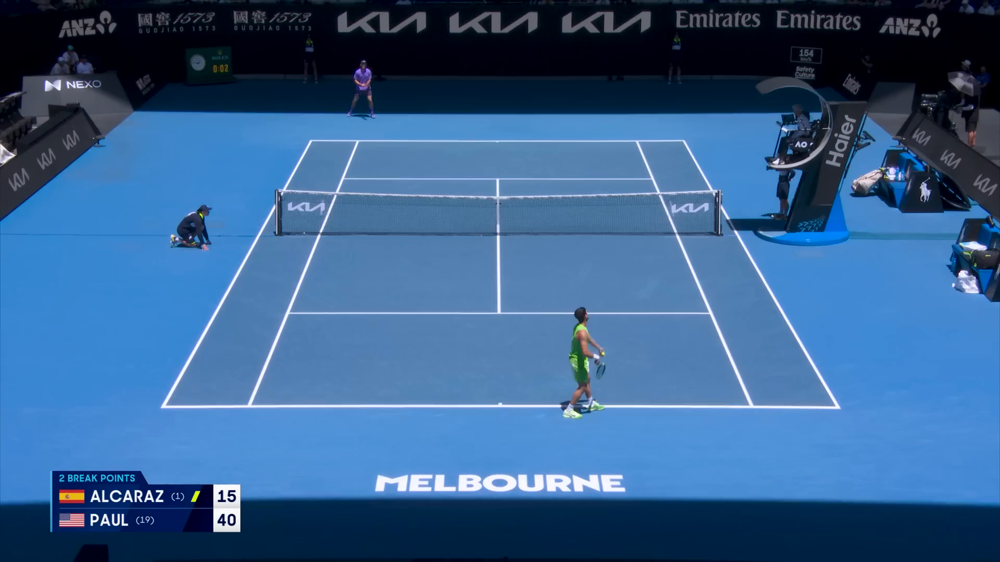
  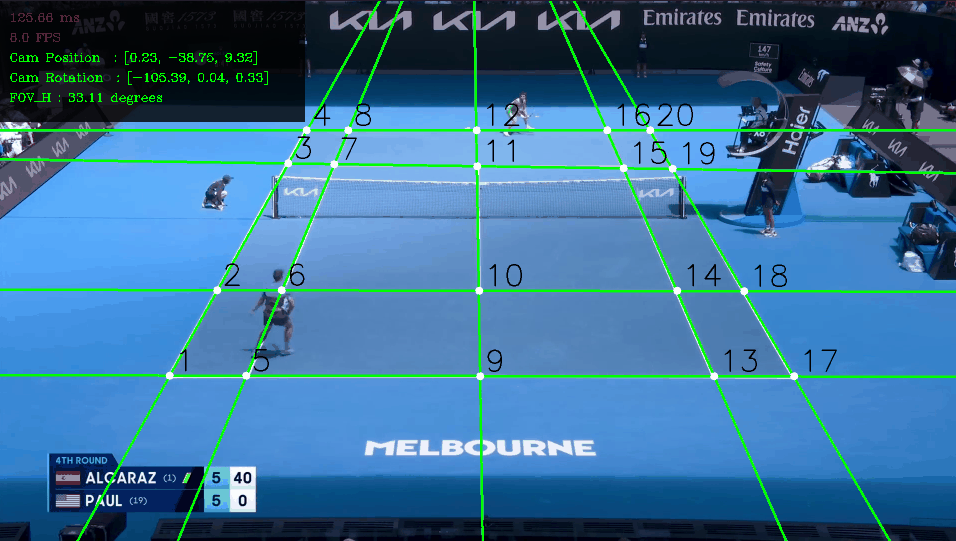
</p>

---

## 1. Technical Overview


This module covers the computer vision pipeline that transforms the synthetic dataset into a functional system capable of understanding the geometry of a tennis court from visual input.

At a high level, the pipeline starts with the synthetic dataset generated in Unreal Engine, consisting of RGB images and their corresponding segmentation masks. These data are used to train a deep learning model for court line segmentation.

Once trained, the model is integrated into an inference pipeline where it processes unseen images—potentially real-world broadcast frames—to produce segmentation outputs. These predictions are then post-processed to extract structural information such as court lines and their intersections.

Finally, this geometric information is used to estimate the camera parameters through techniques such as Homography, enabling the alignment between the image plane and the real-world court. This step is essential for applications such as augmented reality overlays and camera tracking.

The diagram below illustrates the full pipeline. In this README, the focus is placed on the stages highlighted in red, corresponding to training, inference, and geometric reasoning.

<p align="center">
  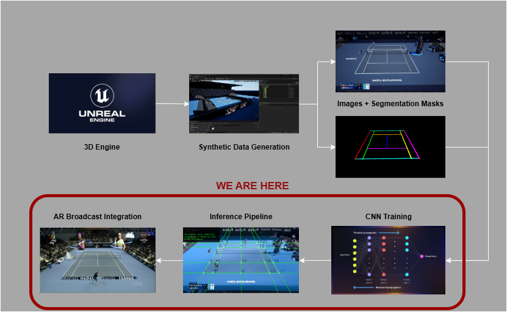
</p>

---

## 2. Dataset and Problem Definition

The dataset used in this project consists of synthetic RGB images and their corresponding segmentation masks, generated using Unreal Engine as described in the previous module.

The core objective is not simply to segment the tennis court, but to extract reliable geometric information from the scene—specifically, the intersections of court lines, which define key reference points.

A direct approach to this problem could involve predicting keypoints (e.g., using heatmaps). However, this strategy was intentionally avoided. Predicting only discrete points would discard a significant amount of structural information present in the scene and make the system more sensitive to noise and occlusions.

Instead, the problem is formulated as a line segmentation task, where the model predicts the full geometry of the court lines at the pixel level. This provides several advantages:

- Preserves the full spatial structure of the court
- Enables more robust extraction of line intersections
- Improves stability under partial occlusions or prediction errors

By segmenting lines rather than directly predicting points, the system retains richer geometric information, which can later be processed to recover precise intersection points.

These intersection points will be used in subsequent stages of the pipeline for geometric reasoning and camera pose estimation.


| HeatMaps (Less Info) | Lines Segmentation (More Info) |
|----------|----------|
| 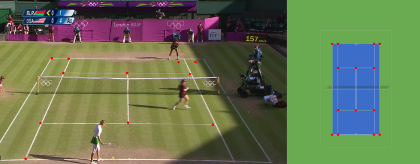 | 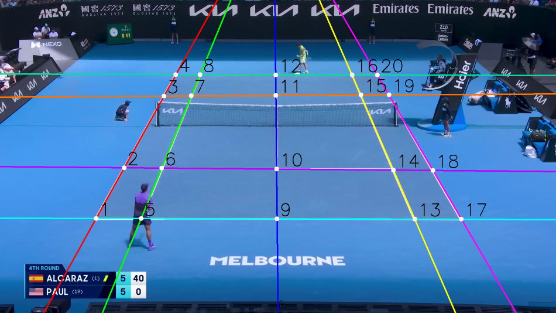 |

---

## 3. Model Arquitecture

The segmentation model used in this project is based on **U-Net**, a widely adopted architecture for semantic segmentation tasks.

<p align="center">
  
  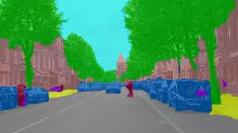
</p>


**U-Net** was selected due to its ability to produce precise, pixel-level predictions while preserving spatial information. Its **encoder–decoder structure** allows the model to capture both high-level contextual features and fine-grained details, which is particularly important for accurately segmenting thin structures such as tennis court lines.

This makes it well-suited for the problem at hand, where the objective is not only to classify regions but to recover the exact geometry of line-based structures that will later be used for geometric reasoning.

Another advantage of U-Net is its robustness when working with relatively small datasets, which aligns with the iterative training strategy followed in this project.

*Note: This README focuses on the application of the model within the pipeline. A more detailed explanation of the U-Net architecture can be found in the following repository 👉 [Repo](https://github.com/AlejandroFontesAlbeza/U-Net-Image-Segmentation)

---

## 4. Training Strategy and Iterative Improvement

The training process followed an iterative approach, starting from a minimal dataset to validate the full pipeline and progressively increasing complexity based on observed model behavior.

Rather than aiming for maximum performance from the beginning, the focus was on building a reliable workflow that allowed rapid experimentation, error analysis, and controlled improvements.

### 4.1 Initial Training (Version 0)

The first version of the model was trained using a small synthetic dataset:

- **5** Level Sequences
- **100** frames per sequence
- Total: **500** images + **500** masks

All sequences were generated using similar camera configurations, with slight variations in position and field of view to approximate a broadcast perspective.

The goal of this stage was not to achieve high accuracy, but to verify that the entire pipeline—from data generation to inference—was functioning correctly.

Training setup:

- **Epochs**: 50
- **Batch size**: 2
- **Hardware**: NVIDIA GTX 1650 Ti 4Gb VRAM
- **Training time**: ~10 hours

Result:

- **mIoU**: ~74%

Despite the limited dataset, the model was able to learn the basic structure of the court, confirming that the synthetic data pipeline was valid.

<p align="center">
  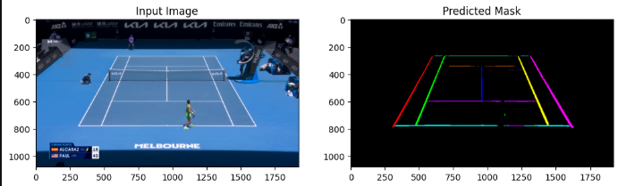
</p>


### 4.2 Error Analysis and Dataset Expansion + Fine-Tuning (Version 1)

To guide further improvements, a set of inference tests was performed on unseen frames. Approximately 10 samples were analyzed to identify consistent failure patterns.

Common issues included:

- Inaccurate segmentation of thin lines
- Errors in complex intersections
- Sensitivity to slight variations in camera perspective

Based on these observations, the dataset was expanded with a targeted strategy:

- Increased sequence length from 100 to 200 frames
- Maintained similar scene configuration
- Introduced additional variability through:
- Camera position
- Camera rotation
- Field of view

This step ensured that new data directly addressed the model’s weaknesses without introducing unnecessary complexity. At the next table you can visualize 6 different frames to see +- the current errors:


| Frame 19 | Frame 50 |
|----------|----------|
|  | 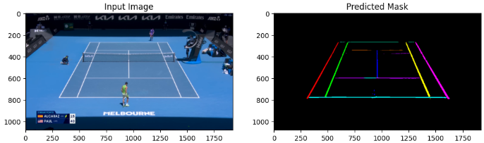 |

| Frame 30 | Frame 224 |
|----------|----------|
| 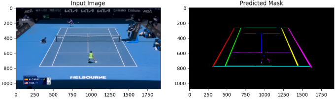 | 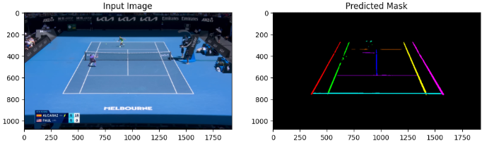 |

Frame 209 | Frame 259 |
----------|----------|
| 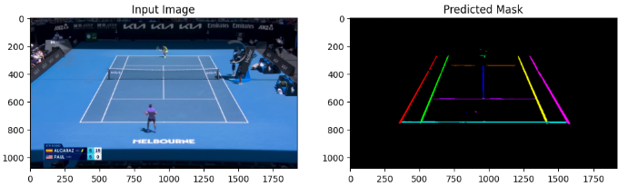 | 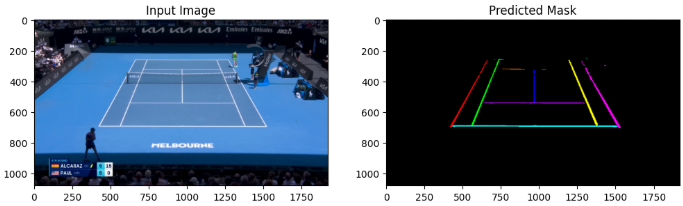 |


After the analysis, the model was fine-tuned using the expanded dataset, keeping the same architecture but adjusting training parameters.

Key decisions:

- No layers were frozen
- The entire network was allowed to adapt to the new data
- A lower learning rate was used to stabilize training and refine learned features

Training setup:

- Epochs: 20
- Reduced learning rate
- Training time: ~5 hours

Result:

- mIoU: ~80%

This stage showed a clear improvement in both segmentation quality and structural consistency.


### 4.3 Final Dataset & Model Refinement + Fine-Tuning (Version 2)

To further improve performance, a final dataset expansion was performed with a stronger focus on structural variability.

Instead of only modifying camera parameters, additional scene elements were adjusted:

- Court line positioning
- Net alignment
- Umpire chair and secondary elements

This introduced subtle geometric variations while maintaining consistency with the reference scenario.

The final dataset consisted of:

- Additional 5 sequences
- 500 frames per sequence
- Total dataset size: ~4000 images + masks

For the final fine-tuning the training setup was:

- Epochs : 30
- Further reduced lr
- Training time: ~10 hours (Larger Dataset and + 10 epochs with the first fine-tuning)
- mIoU = 84%

*The model demonstrated improved robustness, particulary in line continuity, interssections occlusion and stability under viewpoint variations*

<p align="center">
  
</p>


### 4.4 Key Observations
- Starting with a small dataset enabled rapid validation of the full pipeline
- Iterative dataset refinement was more effective than generating large amounts of data upfront
- Allowing the full model to adapt (no layer freezing) improved overall performance
- Controlled variability was essential for improving generalization


---

## 5. Inference, Geometric Reconstruction and Camera Pose Estimation

The objective of the inference stage is to transform the segmentation output of the model into meaningful geometric information, ultimately enabling camera pose estimation.

Rather than treating segmentation as the final output, this pipeline leverages the structural information of the court to reconstruct its geometry and estimate the relationship between the image and the real-world scene.

The process is composed of the following steps:

- Extraction of court lines from segmentation masks
- Detection of line **intersections**
- Estimation of the **Homography**
- **Recovery** of camera parameters from the geometric transformation


### 5.1 Line Extraction from Segmentation

The predicted segmentation mask is first converted into a set of geometric line representations.

For each class corresponding to a court line:

- A binary mask is extracted
- Contours are computed using [cv2.findCountours](https://docs.opencv.org/4.x/d4/d73/tutorial_py_contours_begin.html)
- The largest contour is selected
- A line is fitted using [cv2.fitLine](https://docs.opencv.org/4.x/d3/dc0/group__imgproc__shape.html#gaf849da1fdafa67ee84b1e9a23b93f91f)

To improve robustness:

- Small regions are filtered out using a minimum **pixel threshold**
- Only **dominant contours** are considered
- Lines are extended across the image

This step transforms noisy pixel predictions into stable geometric primitives.

<p align="center">
  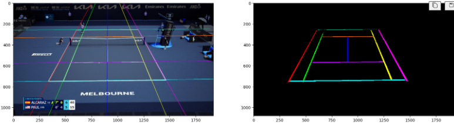
</p>


### 5.2 Intersection Detection

Once the lines are extracted, their intersections are computed.

The relevant intersections are predefined based on the known structure of the tennis court. Each intersection corresponds to a pair of lines defined in a mapping structure.

For each valid pair:

- Lines are expressed in parametric form
- A linear system is solved using numpy.linalg.solve
- The intersection point is computed and stored

This produces a set of 2D image points corresponding to key court locations.


<p align="center">
    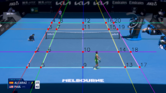
    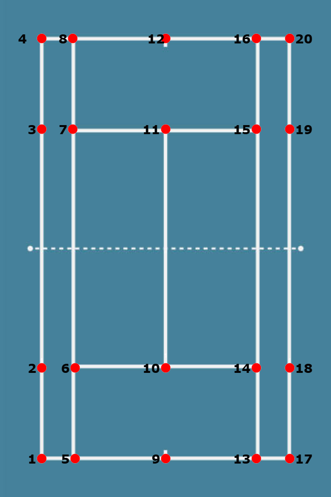
</p>


### 5.3 Homography Estimation + Perspective Transformation

With the detected intersection points, the geometric relationship between the image plane and the tennis court is modeled using a [Homography](https://docs.opencv.org/4.x/d9/dab/tutorial_homography.html)

A homography defines a projective transformation between two planar coordinate systems and is estimated using point correspondences between:

- Image-space coordinates (detected intersections)
- World-space coordinates (predefined court geometry)

At least four non-collinear correspondences are required to solve for the 3×3 transformation matrix, as defined by the degrees of freedom of a projective mapping. The estimation is performed using OpenCV (```cv2.findHomography```).

Given the planar assumption of the tennis court (Z = 0), the homography provides a valid approximation of the transformation between the physical court surface and the image plane.

Once the homography matrix is computed, it is used to project the image into a top-down coordinate system using a perspective transformation (```cv2.warpPerspective```).

This operation applies the estimated projective mapping to each pixel, effectively reconstructing a bird’s-eye view of the court. The resulting transformation enables:

- Validation of geometric consistency
- Visualization of the court in metric space
- Direct spatial interpretation of detected features

The warped output provides a 2D representation where the court geometry is approximately rectified, allowing direct comparison between predicted intersections and their expected real-world positions.

<p align="center">
  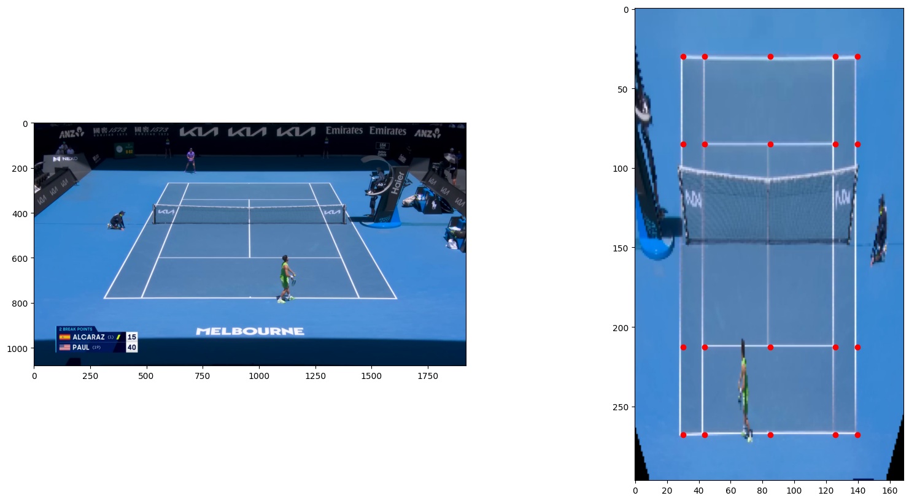
</p>

### 5.4 Camera Pose Estimation from Homography

Given a computed Homography matrix **H**, the goal os this stage is to recover the intrinsic and extrinsic parameters of the camera under the planar scene assumption **Z=0**.
We can express the homography that relates a world plane to the 2D image as:

$$
H = K [r_1 \; r_2 \; t]
$$

where:
- **K**: intrinsic camera matrix
- **r1,r2**: rotation matrix
- **t**: translation vector

#### 5.4.1 Intrinsic Estimation

The intrinsic matrix is defined as:

$$
K=
\begin{bmatrix}
f & 0 & c_x \\
0 & f & c_y \\
0 & 0 & 1
\end{bmatrix}
$$

The focal length f is estimated by enforcing geometric constraints:
$$
r_1 \cdot r_2 \approx 0
$$

$$
\| r_1\| \approx \|r_2\|
$$

The **optimal value** is obtained by minimizing:

$$
E(f) = (r_1 \cdot r_2)^2 + λ(\|r_1\| - \|r_2\|)^2
$$


#### 5.4.2 Pose Recovery

The **extrinsic parameters** are recovered as:
$$
K^{-1} H = [r_1r_2t]
$$

After **normalization**:

$$
L = \frac{1}{\|r_1\|}
$$

The **third axis** and the Initial **Rotation matrix** are computed as:

$$
r_3 = r_1 \times r_2
$$

$$
R = [r_1r_2r_3]
$$


An extra that can guarentee a physical valid rotation matrix satisfying orthogonality constraints and enforce validity in the special orthohonal group SO(3), the matrix is refined using **Singular Value Decomposition**(SVD):

$$
R = U\Sigma V^T -> R = UV^T
$$

To distinguishe the translation between the camera space and the world reference frame we need to calculate the **camera position** in world coordinates that is derived from the extrinsic relationship:

$$
C = -R^Tt
$$

Finally, to get all the camera data necessary por the pose estimation is to calculate the FOV, in this case I used de **Horizontal FOV** because is the same as in **Unreal Engine** camera properties:


$$
FOV_H = 2arctan(\frac{c_x}{f})
$$

This allows dynamic adaptation of the camera model under varying zoom conditions, making it consistent with real broadcast camera behavior.

<p align="center">
  
</p>


