# Synthetic Data Generation Unreal Engine 5

Computer Vision systems rely heavily on large, high-quality annotated datasets. However, creating these datasets is often the most time-consuming and expensive part of the development process. Manual annotation is not only slow but also prone to inconsistencies, especially in tasks that require pixel-level precision such as semantic segmentation.

Synthetic data generation has emerged as a viable alternative to traditional data collection and labeling workflows. By leveraging 3D engines, it is possible to generate fully annotated datasets automatically, with perfect alignment between images and labels. This approach enables rapid dataset creation, full control over scene conditions, and eliminates human annotation errors.

In this project, Unreal Engine is used to generate a synthetic dataset for the segmentation of tennis court lines. The goal is to demonstrate that a model trained entirely on synthetic data can learn meaningful visual features and generalize to the target task without relying on manually labeled real-world data even if you are not a good artist to recreate this type of scenearios. Obviusly there a improvement at this part because i am a software engineer and this type of things are always the worst parts.

This module focuses specifically on the data generation pipeline: from scene creation and variation design to automated rendering and mask extraction.

  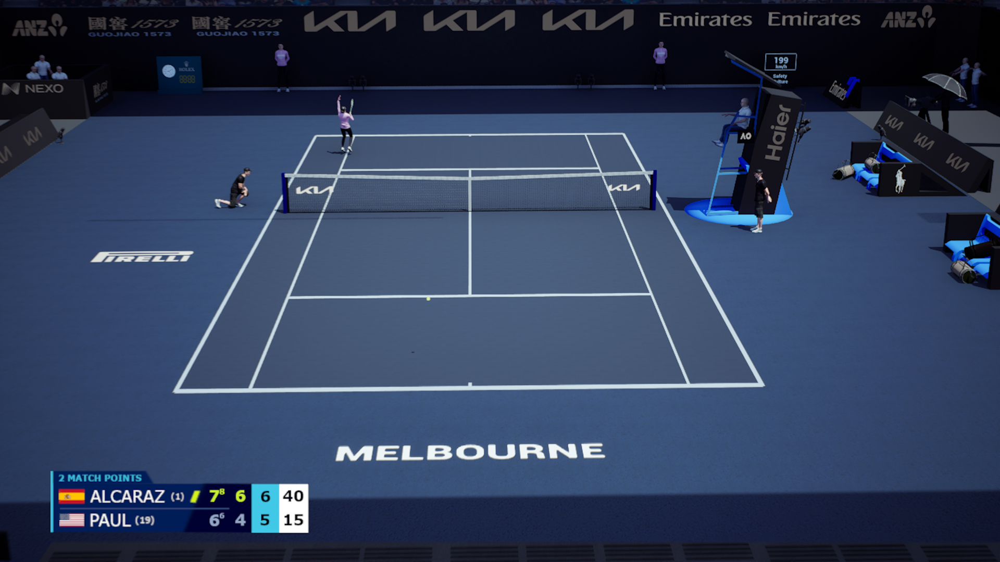
  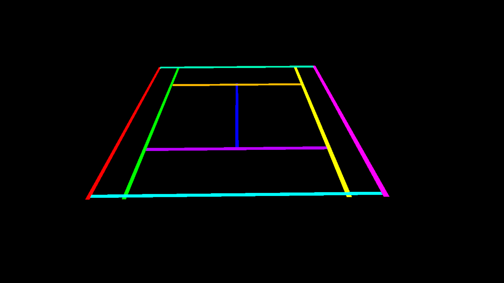

---

## 1. Technical Overview

This project is structured as an end-to-end pipeline that integrates synthetic data generation, deep learning, and real-time rendering.

At a high level, Unreal Engine is used to generate synthetic images of a tennis court along with perfectly aligned segmentation masks in a few seconds, what normally this type of actions will cost a lot of human hours manual annotation. These datasets are then used to train a neural network for line segmentation using PyTorch. The trained model is later integrated into an inference pipeline, where it is used to extract geometric information from images, enabling camera pose estimation and augmented reality overlays.

The purpose of this section is to provide a simplified view of how each component interacts within the system. The diagram below highlights the main stages of the pipeline and the flow of data between them.

  

---

## 2. Why Unreal Engine?

Unreal Engine was selected as the core platform for synthetic data generation due to its ability to provide full control over the visual environment, combined with high-fidelity rendering and flexible automation capabilities.

Unlike traditional dataset creation workflows, which rely on manual annotation tools, a 3D engine enables direct access to scene-level information. This allows for automatic generation of perfectly aligned labels alongside rendered images, eliminating the need for post-processing or human intervention.

Compared to alternatives such as <u>[**Unity**](https://unity.com/es)</u> or <u>[**Blender**](https://www.blender.org/)</u>, [**Unreal Engine**](https://www.unrealengine.com/es-ES) offers a strong balance between visual realism and real-time performance. Its rendering system supports physically-based lighting, which is particularly useful for simulating diverse environmental conditions that improve model robustness.

Additionally, Unreal Engine provides multiple ways to automate data generation, including **Blueprints** and **C++**, making it suitable for building scalable data pipelines without requiring external tools.

From a practical perspective, prior experience with the engine also enabled faster development and iteration, which is a relevant factor in prototyping environments.

---

## 3. Data Generation Strategy

The data generation strategy in this project is intentionally scoped to a controlled and well-defined scenario. Since this is a personal project aimed at validating the feasibility of synthetic data pipelines, the focus is not on building a fully generalized dataset, but rather on replicating a specific real-world setup with sufficient variability to enable model generalization within that context.

The reference scenario used is a broadcast view of a tennis match from the Australian Open, specifically a match between Carlos Alcaraz and Tommy Paul. The synthetic environment was designed to approximate this setup as closely as possible, including camera perspective, court layout, and overall visual composition.

Rather than attempting to cover all possible tennis environments, the approach consists of introducing controlled variability within this reference scenario. This includes modifications in camera positioning, lighting conditions, and scene elements, with the goal of ensuring that the model learns robust features while remaining aligned with the target domain.

This design choice reflects a trade-off between realism and scope. For a production-level system, the dataset would need to incorporate a much broader distribution of conditions, including:

- Different tournaments and court surfaces
- Variations in time of day and lighting
- Multiple camera configurations and broadcast styles
- Environmental factors such as weather and crowd presence
- Other Sports

However, for the purpose of this project, the objective is more focused: to demonstrate that a model trained purely on synthetic data can successfully segment the court lines in a specific real-world scenario that closely matches the generated data.

| Real Image Reference | Synthetic Image Unreal Engine |
|----------|----------|
|  |  |

---

## 4. Synthetic Scene Design and Domain Randomization

### 4.1 Overview

This section describes how the synthetic tennis court environment was configured and how the data generation process was automated. The focus is on the factors that influence model generalization rather than on 3D asset creation, as the goal is to generate a dataset tailored to a specific scenario.

The reference scenario is a broadcast view of the Australian Open match between Carlos Alcaraz and Tommy Paul. The synthetic environment was designed to approximate this setup closely, including camera perspective, court layout, and overall visual composition.

  

### 4.2 Scene Setup

The tennis court was modeled based on official dimensions, with the origin (0,0,0) set at the center of the court. Key elements included:

    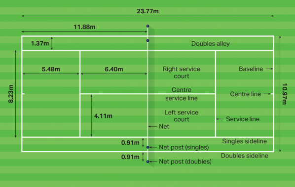

- **Court lines**: defined with appropriate thickness and color, with slight variations introduced to simulate natural differences found in real broadcasts.
- **Players**: placed at randomized positions and poses within the court to reflect realistic variability.
- **Ball**: multiple positions and heights per scene to simulate dynamic play.
- **Other objects**: ball boys, umpire chair, and minor props to mimic the real environment.
- **Grandstands / audience**: generated using images of real crowds with tone adjustments to simulate depth and variation.

    
    
    
    
    
    

### 4.3 Domain Randomization

To improve the robustness and generalization capability of the segmentation model, controlled variability was introduced across multiple aspects of the scene. Rather than relying on a single static configuration, the environment was systematically perturbed to simulate the natural variations observed in real tennis broadcasts.

The goal of this process is to prevent the model from overfitting to specific visual patterns present in the synthetic environment, and instead encourage it to learn invariant features related to the structure of the court lines.

All variations were implemented using Unreal Engine’s Blueprint system, specifically within the Level Blueprint, allowing procedural control over scene parameters at runtime.

**4.3.1 Lighting Variation**

Lighting conditions in real tennis matches can vary significantly depending on the time of day, weather conditions, and stadium configuration. Even within the same match, lighting can change due to camera exposure adjustments or partial shadows.

To simulate this, the following parameters were varied:

- Light intensity
- Light direction
- Shadow distribution

These variations help the model remain robust to contrast changes and prevent sensitivity to specific illumination conditions.

**Implementation**
Lighting parameters were randomized through the Level Blueprint, enabling different configurations to be applied automatically across generated samples.

    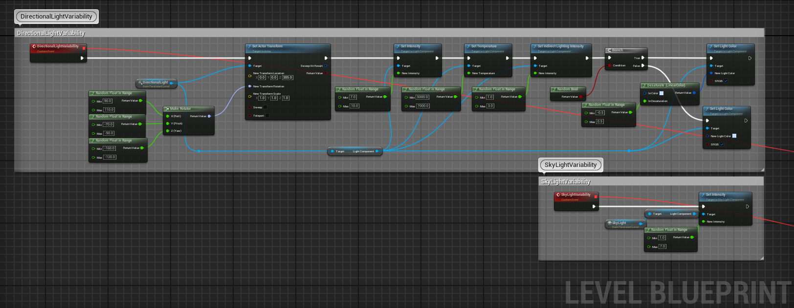
    
    
    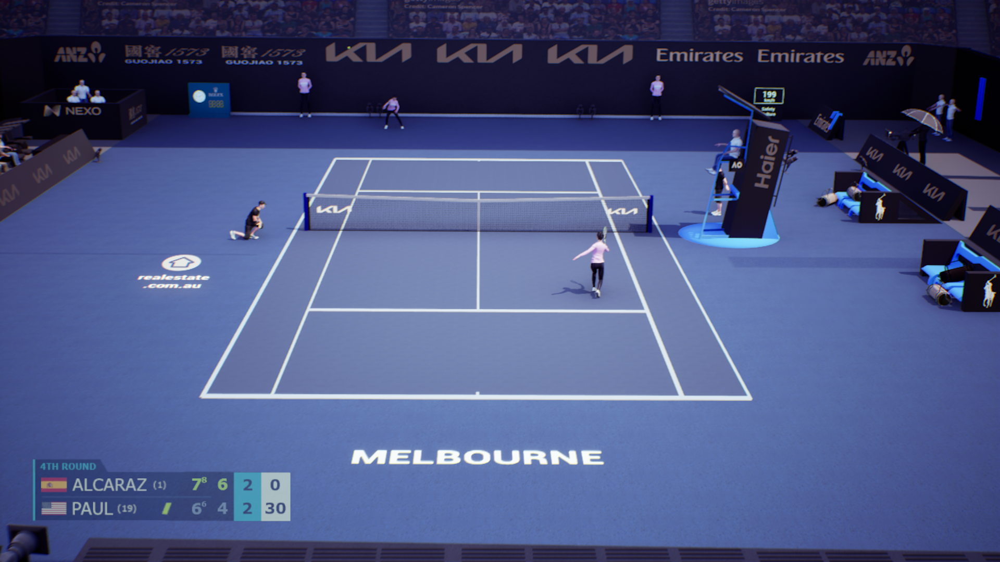
    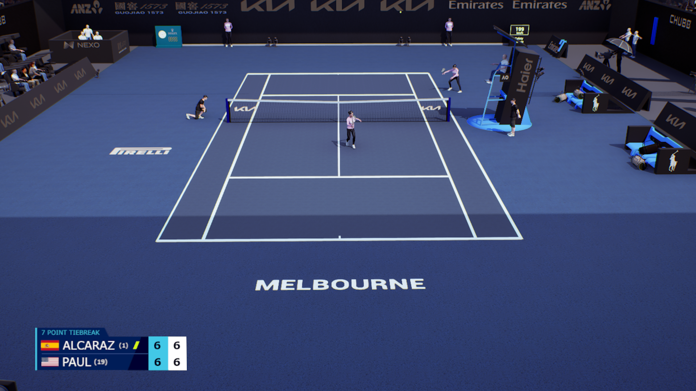

**4.3.2 Player and Ball Variation**

In real scenarios, player positions and ball movement are highly dynamic and unpredictable. Even without full animation, introducing spatial variability is critical to avoid learning fixed scene configurations.

The following variations were applied:

- Player positions within the court
- Player poses (static variations)
- Ball position and height

This ensures that the model does not associate court lines with specific player locations or fixed spatial arrangements.

**Implementation**
Actor transforms (location and rotation) were randomized through the Level Blueprint within predefined spatial constraints.

    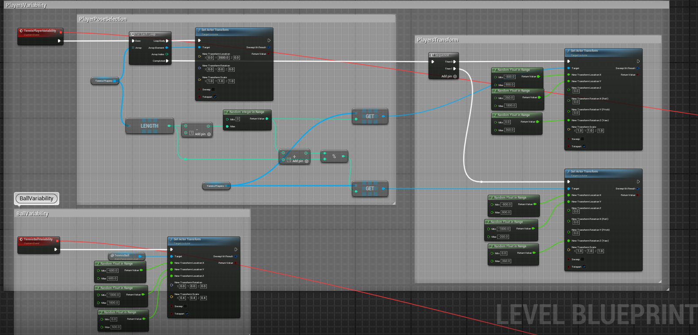
    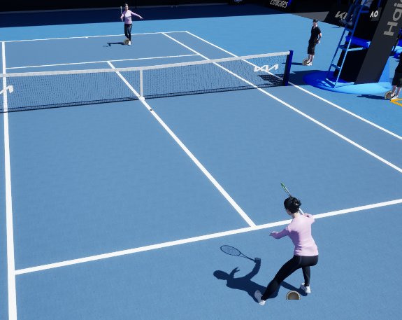
    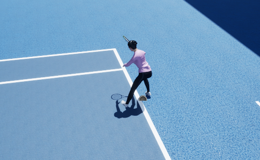
    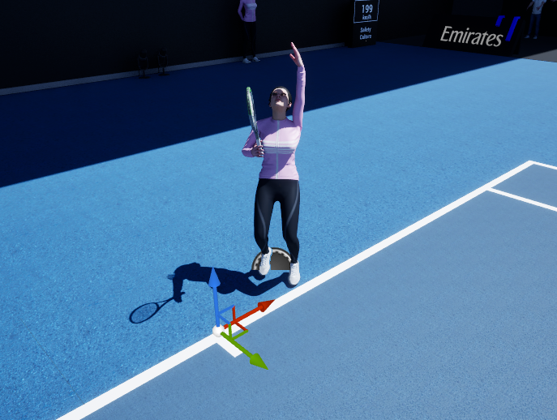
    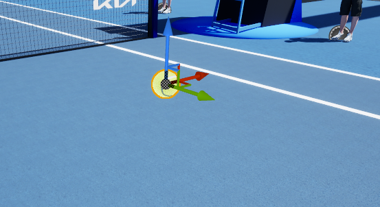

**4.3.3 Secondary Elements Variation**

In addition to primary actors, secondary scene elements were also varied to better approximate real broadcast conditions and avoid introducing static visual patterns.

These include:

- Ball boys and auxiliary characters
- Court-side elements such as umpire chair
- Broadcast-related elements such as logos and on-screen overlays

Although these elements are not the primary target of the segmentation task, their variability helps prevent the model from overfitting to irrelevant but consistent visual cues.

**Implementation**
Placement and visibility of these elements were controlled via the Level Blueprint, allowing different scene compositions across generated samples.

    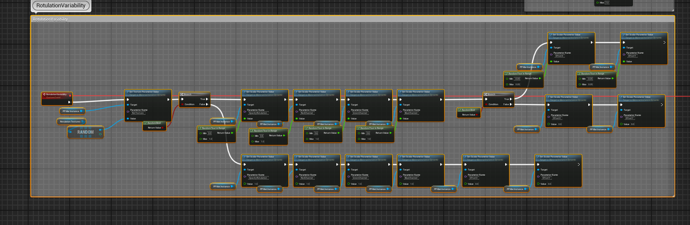
    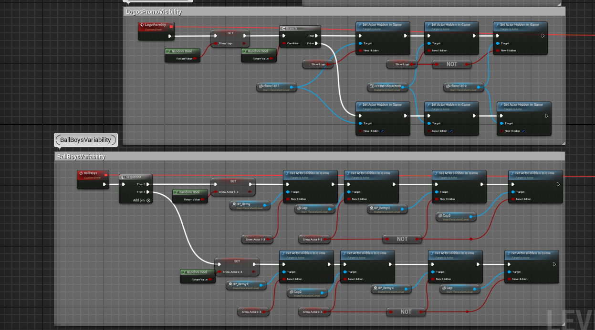
    
    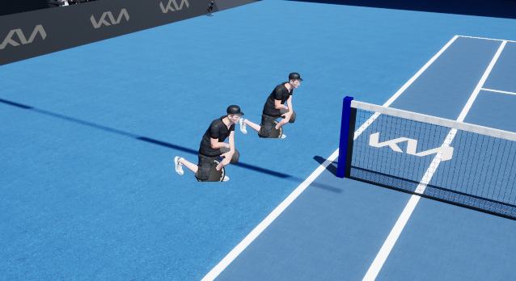
    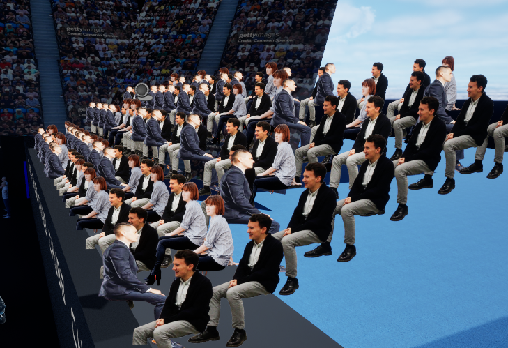
    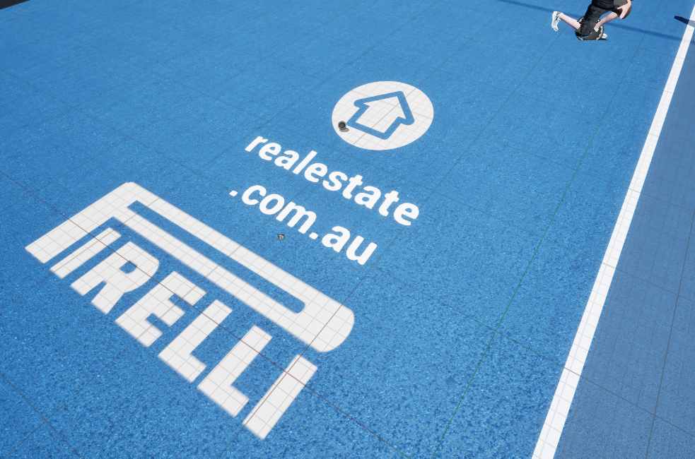
    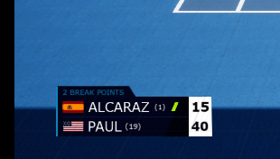

**4.3.4 Court Line & Tennis Net Variability**

Although tennis courts & net follow strict regulations, visual variations still exist in real-world conditions due to wear, repainting, and camera perception.

To account for this, controlled variations were introduced in:

- Line thickness
- Line color intensity

This prevents the model from overfitting to a single idealized representation of court & net lines.

**Implementation**
Material parameters were adjusted dynamically through the Level Blueprint, allowing small variations in appearance across samples.

    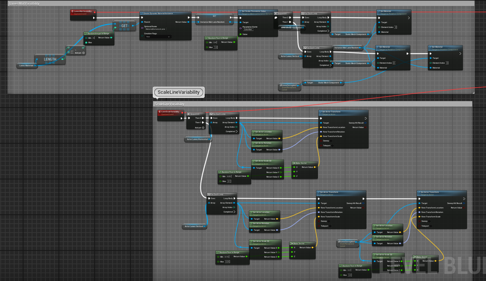
    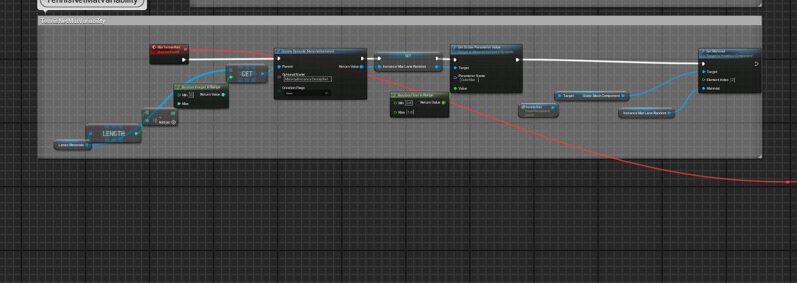
    
    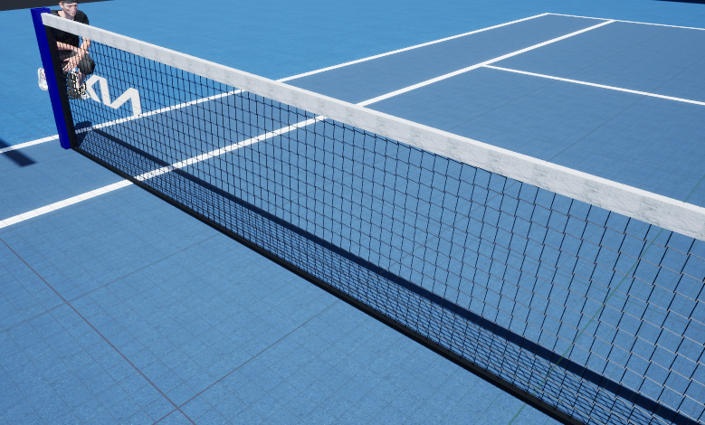

**4.3.5 Court Surface and Background Color Variation**

In real-world scenarios, the appearance of the tennis court can vary significantly depending on the tournament, lighting conditions, camera settings, and surface material. Even within the same court, perceived color can shift due to exposure, shadows, and broadcast processing.

To account for this, controlled variations were introduced in the overall tone of the playing surface:

- Court surface tone: slight variations of the base color were applied to simulate differences in lighting and broadcast conditions while maintaining consistency with the reference scenario.
- Outer court / background areas: the surrounding surface (typically darker regions) was also varied in tone to ensure the model does not rely on a fixed contrast between the court and its surroundings.

This is particularly important to prevent the model from overfitting to a specific color distribution and instead focus on structural features such as line geometry.

**Implementation**
Material parameters controlling color were dynamically adjusted through the Level Blueprint, enabling subtle but consistent variations across generated samples.

    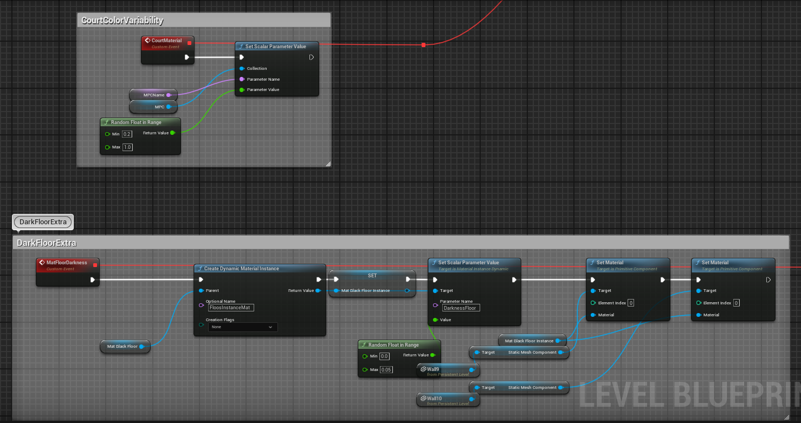
    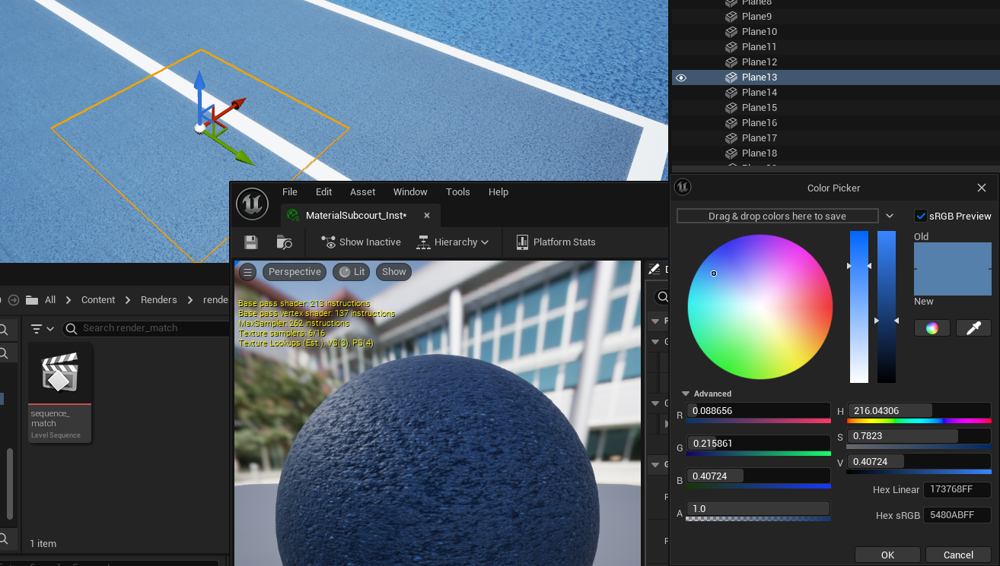
    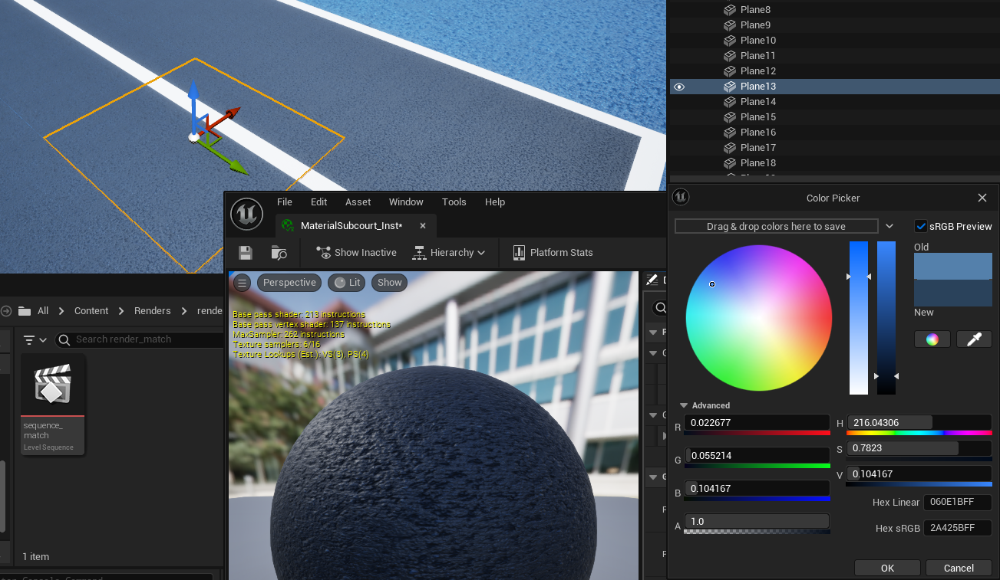

---

### 5. Rendering Pipeline and Dataset Generation

**5.1 Segmentation Mask Generation (Stencil Buffer + Post-Processing)**

To generate accurate segmentation labels, Unreal Engine’s stencil buffer was used in combination with a custom post-processing (PP) material.

Each relevant element of the tennis court—specifically the different court lines—was assigned a unique stencil value (from 1 to 10). These stencil values were then mapped to distinct colors through the PP material, producing a color-coded segmentation mask.

This approach ensures that:

- Each class is clearly separated by a unique color
- Masks are perfectly aligned with the rendered RGB images
- Lighting, shadows, and global illumination do not affect the output

The use of a post-processing material is critical, as it allows overriding the final render and directly visualizing the stencil buffer. This guarantees pixel-perfect masks, independent of scene lighting or material properties.

**Implementation details**

- Stencil buffer enabled in Unreal Engine
- Unique stencil values assigned per court line
- PP material applied at the camera level
- Color mapping defined inside the PP material

    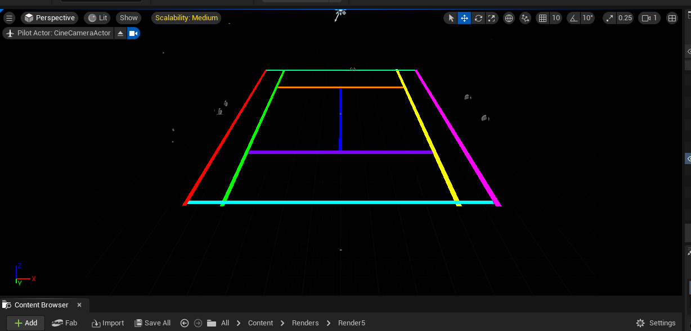
    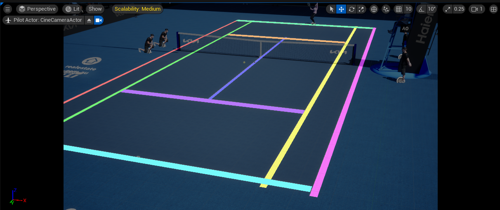
    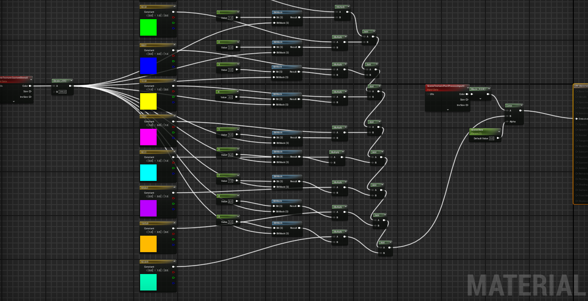

**5.2 Automated Rendering with Level Sequences and Movie Render Queue**

The dataset generation process was implemented using Unreal Engine’s Level Sequencer and Movie Render Queue, enabling automated and reproducible rendering.

**Initial Dataset Strategy**

As an initial validation step (version 0 of the model), a small dataset was generated to quickly verify the full pipeline—from data generation to inference—before scaling to larger datasets.

The dataset was constructed as follows:

- **5 Level Sequences**
- **100 frames per sequence**
- **Total: 500 RGB images + 500 segmentation masks**

Each Level Sequence represents a different camera configuration, including:

- Camera **position** and **rotation**
- Camera **aperture**
- **Focal length**

All parameters were selected to reflect realistic broadcast camera setups.

This approach allowed introducing controlled variability in viewpoint while keeping the dataset size manageable for rapid experimentation.

    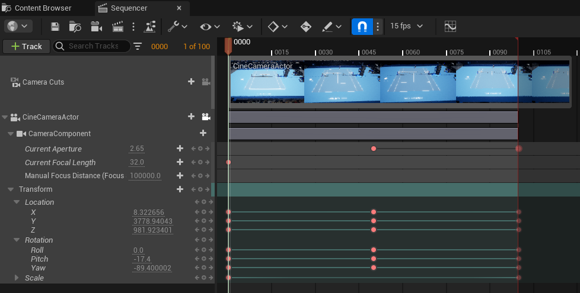

**5.3Rendering Pipeline**
The rendering process was executed in two stages using the Movie Render Queue:

**5.3.1. RGB Image Generation**
- No post-processing applied
- Output stored in:
    ``renderUE/images/``
*These images represent the input to the segmentation model*

    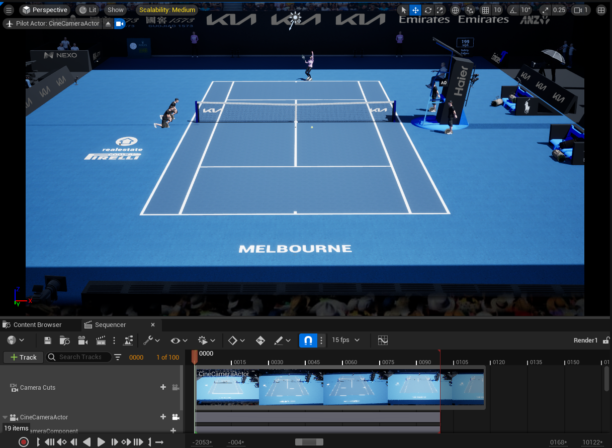

**5.3.2. Segmentation Mask Generation**
- Post-processing material enabled (stencil visualization)
- Same sequences rendered again
- Output stored in:
    ``renderUE/masks/``
*Because both renders use the same Level Sequences and camera configurations, each RGB image has a perfectly aligned corresponding mask.*

    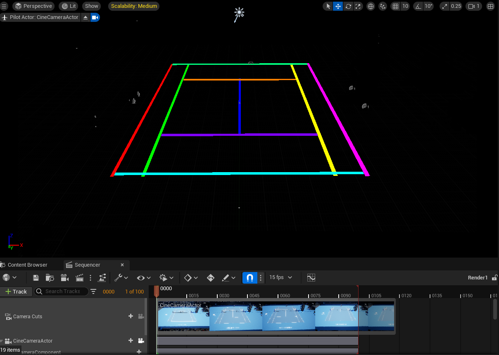

**Key Advantages**
- Fully automated dataset generation
- Pixel-perfect alignment between images and masks
- Fast iteration cycle for experimentation
- Easy scalability to larger datasets

---

## 6. Limitations and Future Improvements

While the current implementation successfully demonstrates the feasibility of using synthetic data for training a segmentation model, it is important to acknowledge its limitations and outline potential improvements for scaling the approach.

### 6.1 Current Limitations

- **Limited scenario scope**
The dataset is based on a single reference setup inspired by a specific broadcast scenario. As a result, the model may struggle to generalize to different tournaments, court types, or camera styles.
- **Simplified scene realism**
The visual quality of the environment is sufficient for the task but does not fully capture the complexity of real-world broadcasts, including fine textures, motion blur, and natural imperfections.
- **Static actors**
Players and secondary elements are represented using static poses rather than fully animated sequences, limiting realism in dynamic interactions.
- **Restricted variability**
Although domain randomization was applied, it remains constrained compared to the diversity present in real-world data distributions.

### 6.2 Future Improvements

To extend this approach towards a production-level system, several enhancements could be implemented:

- **Expanded domain coverage**
    - Different tournaments and court surfaces
    - Wider range of lighting conditions (day/night transitions)
    - Multiple broadcast camera styles
- **Improved realism**
    - Higher-quality assets and textures
    - Physically accurate materials
    - Motion blur and camera noise simulation
- **Dynamic scene elements**
    - Animated players and ball trajectories
    - More realistic interactions between objects
- **Advanced domain randomization**
    - Weather conditions
    - Crowd variability
    - Camera artifacts (blur, exposure shifts, compression noise)
- **Larger-scale dataset generation**
    - Increased number of sequences and frames(although at the other REAMDE I explain when we can increase the datasets during training and inference pipeline)
    - Automated dataset balancing

---
## 7. Download UProject

The full Unreal Engine project used for synthetic data generation is available at the following link:

👉 [UProject](https://drive.google.com/file/d/1mb0NPwv27Z4TiGMSy594WlGWT0dTwCwh/view?usp=sharing)

**This includes:**

- Scene configuration
- Level Blueprints for domain randomization
- Level Sequences used for rendering
- Post-processing setup for segmentation masks

*The project can be used as a reference for building similar synthetic data pipelines or extended for more advanced use cases.*

---

## 8. Conclusion

This part of the project demonstrates that synthetic data generation using a 3D engine can be a viable alternative to manual dataset annotation for computer vision tasks such as semantic segmentation.

By leveraging Unreal Engine, it is possible to build a fully automated pipeline capable of generating aligned image-mask pairs with pixel-perfect accuracy. This significantly reduces the time and effort required for dataset creation while providing full control over scene conditions.

Although the current implementation is intentionally scoped to a specific scenario, the results validate the core hypothesis: a model trained exclusively on synthetic data can learn meaningful visual features and perform effectively in a real-world setting.

This approach opens the door to scalable and reproducible data generation workflows, particularly in domains where manual annotation is costly or impractical.

The next part of the project, as we saw at the initial diagram, now is the turn to start the training and inference pipeline where you can find the explanation [*here*](computer-vision-pipeline.md).
